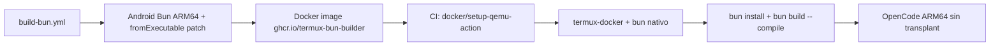

# opencode-termux

Cross-compila [Bun](https://bun.sh) para Android/Termux (aarch64). También compila [OpenCode](https://github.com/anomalyco/opencode) como caso de uso.

## Branch activa

- `update-v1.18.6` es la rama de trabajo. `main` está atrás.
- `README.md` está desactualizado. `scripts/env.sh` es la fuente de verdad de versiones.

## Pipeline

```
build-bun.yml ──→ bun-android binary (cache, ~45 min)
     ↓
build-bun-target.yml ──→ target runtime bundle (OPCIONAL)
     ↓
build-opencode.yml ──→ OpenCode binary + packages (~5 min)
```

### build-bun.yml
- Cross-compila Bun 1.3.14 para Android ARM64 via `scripts/build.ts` → `build.ninja` → `ninja`
- Aplica parches de `patches/` ANTES del build
- Cache key incluye SHA256 de los 7 parches activos

### build-opencode.yml
- Consume Android Bun del caché de build-bun.yml (`fail-on-cache-miss: true`)
- Compila `libopentui.so` con Zig (target musl + patchelf)
- Build de OpenCode via `build-opencode-android.ts`
- Produce ZIP + pacman + deb packages

## ⚠️ Cómo NO compilar

**NUNCA uses `--compile-executable-path`**. Modifica el ELF añadiendo una sección `.bun` via `elf.zig:writeBunSection()`, que corrompe binarios Android ARM64 (SIGTRAP en startup).

**NUNCA uses `--target=bun-linux-arm64-android`**. Causa errores de resolución de módulos.

## Cómo SÍ funciona

El approach correcto (implementado en `build-opencode-android.ts`):

1. **Compilar para HOST**: `bun build --compile` → standalone x86_64
2. **Extraer module graph**: leer la sección `.bun` del ELF del host binary
3. **Raw append**: concatenar al Android Bun sin modificar su ELF
4. **Trailer al final**: `[bun runtime] [module graph] \n---- Bun! ----\n [total_byte_count u64 LE]`

### fromExecutable bug (upstream)

`StandaloneModuleGraph.fromExecutable()` llama a `ELF.getData()` que lee `BUN_COMPILED.size`. Si el `.bun` section está vacío (vaddr=0) → retorna null → `fromExecutable()` hace `orelse return null` → Bun arranca como CLI normal. **No hay fallback para buscar el trailer al final del archivo.**

El parche `patches/bun/android-standalone-raw-append.patch` añade ese fallback en `fromExecutable()` y el raw append en `inject()`.

## Stack (no-obvio)

- **Dos Zigs**: Bun necesita el fork `oven-sh/zig`. OpenTUI usa ziglang.org 0.15.2. NO mezclar.
- **Host Bun debe coincidir con target Bun** (ambos 1.3.14) para compatibilidad del module graph.
- **ICU 75.1**: Se cross-compila desde fuente. No hay binarios prebuilt para Android.
- **OpenTUI con musl, no NDK**: `build-opentui.sh` usa target `aarch64-linux-musl` y luego `patchelf --add-needed libc.so`.
- **Bionic stubs**: `libdl.so`, `libpthread.so`, `librt.so`, `libutil.so` no existen en NDK — están en libc. `setup-runner.sh` crea stubs con `echo 'INPUT(-lc)'`.
- **API level 24**: Mínimo para Termux 64-bit.

## Parches

| Parche | Estado | Dónde se aplica | Notas |
|--------|--------|-----------------|-------|
| `patches/bun/pr31198.diff` | ✅ ACTIVO | `apply-patches.sh` | Fix `CouldntReadCurrentDirectory` en Android |
| `patches/bun/android-support.patch` | ⏭️ SKIPPED | `apply-patches.sh` (comentado) | Ya está en Bun 1.3.14 upstream |
| `patches/bun/android-default-backend.patch` | ✅ ACTIVO | `apply-patches.sh` | Default install backend = symlink |
| `patches/bun/android-standalone-raw-append.patch` | ✅ ACTIVO | `apply-patches.sh` | inject() raw append + fromExecutable() fallback |
| `patches/bun/android-global-shebang-fix.patch` | ✅ ACTIVO | `apply-patches.sh` | Fix shebangs (`node`→`bun`) en global install |
| `patches/bun/android-global-transitive-deps.patch` | ✅ ACTIVO | `apply-patches.sh` | Fix transitive deps + resolver + standalone en global install |
| `patches/webkit/android-support.patch` | ✅ ACTIVO | `apply-patches.sh` | JSC Android: polling traps, aligned_alloc |
| `patches/zig/posix-android-sigaction.patch` | 🔄 APLICADO POR BUILD | `build-bun.sh` (implícito) | Al vendor/zig/ que Bun descarga |
| `patches/bun/build-zig-no-link-obj.patch` | 📎 REFERENCIA | Inline con sed+python3 | Solo documentación, el parche real es inline |
| `patches/opentui/android-libc-link.patch` | ⚠️ HUÉRFANO | No se aplica | build-opentui.sh usa musl + patchelf |

## Bugs Conocidos (Bun upstream)

- **`bun add -g` no instala dependencias transitivas** → [#25110](https://github.com/oven-sh/bun/issues/25110)
  - Las dependencias directas se instalan en `~/.bun/install/global/node_modules/`
  - Las dependencias transitivas (deps de deps) NO se instalan → `MODULE_NOT_FOUND`
  - Workaround: usar `bunx <paquete>` en vez de `bun add -g`
  - PR #30659 (abierto) intenta fixear el walk-up del global dir
  - PR #30473 (merged) deshabilitó global virtual store por defecto
  - PR #32182 (merged) fixea stale symlinks del global store

## Cachés (actions/cache)

| Clave | Contenido | fail-on-cache-miss |
|-------|-----------|-------------------|
| `android-ndk-28.1.13356709` | NDK ~1.5 GB | no |
| `zig-0.15.2` | Zig estándar ~300 MB | no |
| `icu-android-75.1-24` | ICU cross-compilado | no |
| `webkit-android-<commit>-<patch_hash>` | WebKit build | **sí** |
| `bun-android-1.3.14-<7_hashes>` | Binario Bun ~88 MB | no |
| `bun-host-1.3.14` | Host bun ~737 MB | no |
| `opentui-android` | libopentui.so | no |

## Comandos clave

```bash
# Disparar builds desde CLI
gh workflow run build-bun.yml --ref update-v1.18.6
gh workflow run build-opencode.yml --ref update-v1.18.6

# Monitorear (NUNCA uses --progress)
gita notify build-bun.yml
gita notify build-opencode.yml

# Instalar Bun en Termux
./install.sh --just bun

# Build local (NO en Termux — OOM killer)
source scripts/env.sh
./scripts/apply-patches.sh
./scripts/build-bun.sh        # ~45 min, requiere x86_64
./scripts/build-opentui.sh
./scripts/build-opencode.sh
```

## Constraintes duras

- **NO compilar Bun en Termux**. Android OOM killer mata procesos >500 MB RAM. Siempre GitHub Actions.
- **LLVM/Clang 21**: Bun 1.3.14 configure requiere Clang 21. NDK trae Clang 19. `setup-runner.sh` crea symlinks de compiler-rt.
- **Strip ARM64**: `build.ninja` usa `/usr/bin/strip` (x86_64). `build-bun.sh` lo parchea a `llvm-strip` del NDK.
- **`@parcel/watcher`**: Binding nativo `.node` es x86_64, no funciona en Android.
- **`bun upgrade`**: Deshabilitado en Android.
## 🚧 Pendientes

| Prioridad | Tarea | Estado |
|-----------|-------|--------|
| 🔴 Alta | Rebuild Android Bun con parche fromExecutable() + fromExecutable en CI | ⏳ Pendiente |
| 🟢 Hecho | `fromExecutable()` parche funciona — test ./tmp/main.ts pasa | ✅ Verificado |
| 🟢 Hecho | Module graph transplant genera binario 185MB AArch64 funcional | ✅ Verificado |
| 🟡 Media | Implementar build vía termux-docker + QEMU (elimina transplant) | ⏳ Pendiente |
| 🟡 Media | Evaluar si el bug #25110 de `bun add -g` aplica a nuestro Bun ARM64 | ⏳ Pendiente |

## Próximo: Build vía Termux-Docker + QEMU

Eliminar el module graph transplant usando `termux/termux-docker:aarch64` con QEMU.

### Diseño



### Dockerfile propuesto

```dockerfile
FROM termux/termux-docker:aarch64
RUN apt update && apt install -y git tar xz-utils
COPY bun-android /data/data/com.termux/files/usr/bin/bun
RUN chmod +x /data/data/com.termux/files/usr/bin/bun
```

### Workflow futuro: `build-opencode-docker.yml`

```yaml
jobs:
  build:
    runs-on: ubuntu-latest
    steps:
      - uses: actions/checkout@v4
      - uses: docker/setup-qemu-action@v3
      - name: Build OpenCode
        run: |
          docker run --rm \
            -v $PWD:/workspace \
            ghcr.io/termux-bun-builder:latest \
            bash -c "
              cd /workspace/opencode/packages/opencode
              bun install
              bun build --compile --outfile=/tmp/opencode ./src/index.ts
              cp /tmp/opencode /workspace/dist/opencode
            "
```

### Cachés

| Cache | Clave | Path |
|-------|-------|------|
| Docker image | `bun-builder-<hash>` | ghcr.io |
| node_modules | `opencode-nm-<lockfile_hash>` | actions/cache, montado en contenedor |
| OpenCode source | `opencode-src-<version>` | actions/cache |

### Notas

- `writeBunSection()` corre en ARM64 nativo dentro del contenedor → **NO corrompe el ELF** (el bug ocurría porque x86_64 modificaba ELF ARM64)
- El parche `fromExecutable()` sigue siendo útil como safety net
- `bun install` dentro de termux-docker obtiene bindings ARM64 automáticamente
- QEMU añade ~3-5 min al build comparado con native x86_64

- **Dockerfile** está en `scripts/Dockerfile`, no en la raíz.
