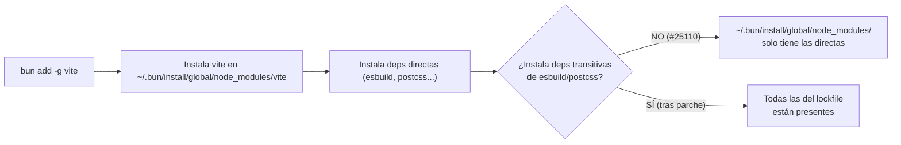

# opencode-termux

Soporte de [Bun](https://bun.sh) para Android/Termux (aarch64).
Originalmente para cross-compilar [OpenCode](https://github.com/anomalyco/opencode), ahora también como base para ejecutar Bun y sus paquetes en Termux.

## Objetivos

- **Cross-compilar Bun 1.3.14** para Android ARM64 con parches necesarios
- **Compilar OpenCode** para Android ARM64 como standalone binary
- **Soporte global** de paquetes npm en Termux via `bun add -g`

## Pipeline actual

```
build-bun.yml → Android Bun ARM64 (con parches de compatibilidad)
     ↓
build-opencode.yml → module graph transplant + raw append → OpenCode ARM64
```

## Pipeline futuro (termux-docker)

```
build-bun.yml → Android Bun ARM64
     ↓
build-opencode-docker.yml → termux-docker + QEMU → bun build --compile nativo
```

## Stack

- **Bun 1.3.14**: Cross-compilado para Android ARM64 via NDK r28 + Clang 21
- **ICU 75.1**: Cross-compilado desde fuente para Android
- **WebKit/JSC**: Commit `017930ebf915121f8f593bef61cbbca82d78132d`
- **API level 24**: Mínimo para Termux 64-bit

## Parches Aplicados (Bun)

| Parche | Estado | Propósito |
|--------|--------|-----------|
| `pr31198.diff` | ✅ ACTIVO | Fix `CouldntReadCurrentDirectory` en Android |
| `android-default-backend.patch` | ✅ ACTIVO | Default install backend = symlink |
| `webkit/android-support.patch` | ✅ ACTIVO | JSC Android: polling traps, aligned_alloc |
| `zig/posix-android-sigaction.patch` | ✅ ACTIVO | Fix sigaction en Android para vendor/zig |
| `android-standalone-raw-append.patch` | ✅ ACTIVO | inject() raw append + fromExecutable() fallback |
| `android-global-shebang-fix.patch` | ✅ ACTIVO | Reemplaza `node` → `bun` en shebangs de binarios globales |
| `android-global-transitive-deps.patch` | ✅ ACTIVO | Verifica + corrige instalación de dependencias transitivas en `bun add -g` |
| `android-support.patch` | ⏭️ SKIPPED | Ya está en Bun 1.3.14 upstream |
| `build-zig-no-link-obj.patch` | 📎 REFERENCIA | Aplicado inline con sed+python3 |
| `opentui/android-libc-link.patch` | ⚠️ HUÉRFANO | build-opentui.sh usa musl + patchelf |

## Bugs Conocidos (Bun upstream)

### `bun add -g` — Dependencias transitivas no instaladas

Al ejecutar `bun add -g <paquete>`, Bun instala correctamente el paquete solicitado y sus
dependencias **directas** en `~/.bun/install/global/node_modules/`, pero las dependencias
**transitivas** (dependencias de dependencias) pueden quedar sin instalar, provocando
`MODULE_NOT_FOUND` en tiempo de ejecución.

→ Issue upstream: [#25110](https://github.com/oven-sh/bun/issues/25110)

#### Cadena del problema



**¿Por qué ocurre?**

1. `bun add -g` instala las dependencias directas pero **no itera recursivamente** sobre las
   dependencias de esas dependencias para el caso global.
2. El lockfile contiene todas las transitivas resueltas, pero el instalador global no las
   materializa en disco.
3. Al ejecutar el binario global, el shebang original (`#!/usr/bin/env node`) invoca Node.js
   (o su alias en Termux), que usa el algoritmo de resolución de Node (`node_modules` walk-up),
   no el de Bun. Como las transitivas no están en `~/.bun/install/global/node_modules/`,
   Node.js lanza `MODULE_NOT_FOUND`.
4. Con Bun como runtime (`bun run <bin>`), el resolver de Bun sí entiende el layout del cache
   global y puede localizar las transitivas — el bug solo se manifiesta cuando el binario es
   ejecutado por Node.js o cuando el shebang original apunta a `node`.

**¿Por qué Bun resuelve pero Node no?**

| Runtime | Resolución de módulos | Resultado |
|---------|----------------------|-----------|
| **Bun** | Resolver propio con soporte para global cache + virtual store | ✅ Encuentra transitivas |
| **Node.js** | Algoritmo estándar `node_modules` walk-up desde el script | ❌ `MODULE_NOT_FOUND` |
| **Bun (vía shebang corregido)** | Ídem Bun | ✅ Encuentra transitivas |

#### Issues y PRs relacionados

| Referencia | Tipo | Estado | Descripción |
|-----------|------|--------|-------------|
| [#25110](https://github.com/oven-sh/bun/issues/25110) | Issue | Abierto | `bun add -g` no instala transitivas |
| [#30659](https://github.com/oven-sh/bun/pull/30659) | PR | Abierto | Walk-up del global dir para encontrar `node_modules` padre |
| [#30473](https://github.com/oven-sh/bun/pull/30473) | PR | ✅ Merged | Deshabilita global virtual store por defecto (causaba problemas de paths) |
| [#32182](https://github.com/oven-sh/bun/pull/32182) | PR | ✅ Merged | Fixea stale symlinks en global store |

#### Soluciones implementadas en este proyecto

Este proyecto incluye **dos parches** que mitigan el bug desde dos ángulos:

**1. `android-global-shebang-fix.patch`** → `src/install/bin.zig`

Reemplaza `#!/usr/bin/env node` por `#!/usr/bin/env bun` en los shebangs de los binarios
instalados globalmente. Así, al ejecutar un binario global, el kernel invoca Bun en lugar de
Node.js, y Bun sabe cómo resolver las dependencias transitivas desde su cache.

```diff
- tryNormalizeShebang(abs_target);
+ tryNormalizeShebang(abs_target, global);

 fn tryNormalizeShebang(abs_target: [:0]const u8, global: bool) void {
     // ... detecta shebangs que terminan en "node" ...
+    if (global and has_node_shebang) {
+        // Reemplaza "node" por "bun" al final del shebang
+        tmpfile.writeAll(new_shebang_content); // base sin "node"
+        tmpfile.writeAll("bun");              // escribe "bun"
+    }
 }
```

**2. `android-global-transitive-deps.patch`** → Multi-archivo

Añade verificación post-install en `PackageManager.zig` y `install_with_manager.zig`:

```zig
// En install_with_manager.zig: después de instalar, verifica
if (manager.options.global) {
    const any_missing = try manager.verifyGlobalPackagesInstalled();
    if (any_missing) {
        // Advierte al usuario y sugiere comando de reparación
        Output.prettyErrorln("Some transitive dependencies may not be fully installed.", .{});
        Output.prettyErrorln("Run bun install --cwd ~/.bun/install/global --production to fix.", .{});
    }
}
```

Además, incluye fixes al resolver (`src/resolver/resolver.zig`) para manejar correctamente
directorios inaccesibles (EACCES) durante el walk-up del `node_modules` global, y al
`StandaloneModuleGraph` para que el raw append funcione correctamente en Android sin ELF
section injection.

#### Workarounds (sin los parches)

| Workaround | Descripción |
|-----------|-------------|
| `bunx <paquete>` | Usar `bunx` en vez de `bun add -g`. Bunx descarga y ejecuta el paquete bajo el resolver de Bun, que sí encuentra transitivas. |
| Wrapper script manual | Crear un script que invoque `bun <ruta-al-binario>` en lugar del symlink directo. |
| `bun install --cwd ~/.bun/install/global --production` | Forzar reinstalación completa en el directorio global para materializar todas las transitivas. |
| Usar `bun run $(which <bin>)` | Ejecutar explícitamente con Bun en vez de depender del shebang. |

#### Referencias en el código fuente

- `src/install/bin.zig` — Líneas 611–720: lógica de normalización de shebangs (parcheada)
- `src/install/PackageManager.zig` — Líneas 1122–1160: función `verifyGlobalPackagesInstalled()` (añadida)
- `src/install/PackageInstall.zig` — Línea 371: método `symlink` como default en Android (añadido)
- `src/install/PackageManager/install_with_manager.zig` — Líneas 922–977: verificación post-install (añadida)
- `src/resolver/resolver.zig` — Líneas 2859–3057: fix de walk-up con EACCES (parcheado)

## Cachés CI

| Clave | Contenido |
|-------|-----------|
| `android-ndk-28.1.13356709` | NDK ~1.5 GB |
| `zig-0.15.2` | Zig estándar ~300 MB |
| `icu-android-75.1-24` | ICU cross-compilado |
| `webkit-android-<commit>-<patch_hash>` | WebKit build |
| `bun-android-1.3.14-<8_hashes>` | Binario Bun ARM64 ~88 MB |
| `bun-host-1.3.14` | Host bun x86_64 ~737 MB |
| `opentui-android` | libopentui.so ARM64 |

## Comandos

```bash
# Disparar builds
gh workflow run build-bun.yml --ref update-v1.18.6
gh workflow run build-opencode.yml --ref update-v1.18.6

# Monitorear
gita notify build-bun.yml
gita notify build-opencode.yml

# Instalar Bun en Termux
./install.sh --just bun

# Build local (NO en Termux — OOM killer)
source scripts/env.sh
./scripts/apply-patches.sh
./scripts/build-bun.sh        # ~45 min, requiere x86_64
```

## ⚠️ Constraints

- **NO compilar Bun en Termux** — OOM killer. Usar GitHub Actions.
- **NO usar `--compile-executable-path`** — Corrumpe ELF Android ARM64.
- **NO usar `bun build --compile --target=bun-linux-arm64-android`** con bun host stock.
- **Dockerfile** está en `scripts/Dockerfile`, no en raíz.
