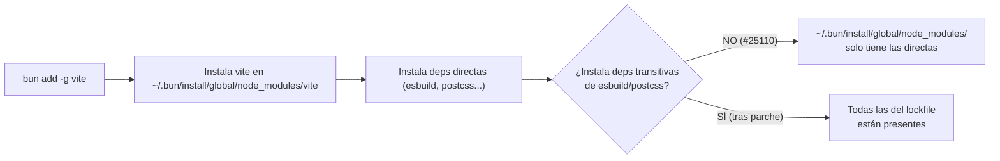

# opencode-termux — Ports nativos de CLIs de IA para Termux

Infraestructura de **ports nativos para Android/Termux** (aarch64) basada en [Bun](https://bun.sh) cross-compilado. Compila dos CLIs de IA de primera clase sobre el mismo pipeline (**Android Bun + libopentui.so**):

- **[OpenCode](https://github.com/anomalyco/opencode)** — build en CI (GitHub Actions, runner ARM64 nativo)
- **[Kilo Code CLI](https://github.com/Kilo-Org/kilocode)** v7.4.20 — port local en Termux (fork de opencode)

## Objetivos

- **Cross-compilar Bun 1.3.14** para Android ARM64 con parches necesarios (base de ambos ports)
- **Compilar OpenCode** para Android ARM64 como standalone binary (CI)
- **Compilar Kilo Code CLI v7.4.20** para Android ARM64 como standalone binary (local en Termux)
- **Soporte global** de paquetes npm en Termux via `bun add -g`

## Puertos

Dos casos de uso de primera clase sobre el mismo pipeline (Android Bun + libopentui.so):

| | OpenCode | Kilo Code CLI |
|---|----------|---------------|
| **Fuente** | [anomalyco/opencode](https://github.com/anomalyco/opencode) (default `v1.18.11`) | [Kilo-Org/kilocode](https://github.com/Kilo-Org/kilocode) `v7.4.20` (fork de opencode) |
| **Dónde se compila** | GitHub Actions — `build-opencode.yml` (runner ARM64 nativo) | Local en Termux — `./kilocode_build.sh` (integración CI pendiente) |
| **Binary resultante** | `opencode-android` + Release con 3 assets (opencode zip + bun tar.gz + libopentui.so tar.gz) | `./kilo-android` (standalone ~149 MB) |
| **Piezas OpenTUI** | `@opentui/*` **0.4.5** | `@opentui/*` **0.3.4** |
| **Verificación** | CI + `./install.sh` | TUI funcional en pty real; modelo de IA responde |

### OpenCode

```bash
# Build en CI (runner ARM64 nativo — host y target ARM64 coinciden)
gh workflow run build-opencode.yml --ref update-v1.18.6

# Build local (requiere host x86_64; NO en Termux — OOM killer)
source scripts/env.sh
./scripts/apply-patches.sh
./scripts/build-bun.sh        # ~45 min
./scripts/build-opencode.sh

# Instalar en Termux (descarga GitHub Releases, NO compila)
./install.sh --just opencode --release v1.18.11
```

### Kilo Code CLI (port local)

```bash
# Build local en Termux (fingerprint incremental; skip total si nada cambió)
./kilocode_build.sh          # produce ./kilo-android
./kilo-android --version     # → 7.4.20
./kilo-android --help
./kilo-android models        # 283 modelos del snapshot models.dev baked
```

> Detalles del port de Kilo (src, hallazgos del toolchain, fix de la TUI) en [AGENTS.md](AGENTS.md).

## Pipeline actual

```
build-bun.yml ──→ Android Bun ARM64 (con parches de compatibilidad)
     ↓
build-opentui.yml ──→ libopentui.so (zig 0.15.2 estándar, aarch64-linux-musl)
     ↓
build-opencode.yml ──→ runner ARM64 nativo (ubuntu-24.04-arm)
                  ──→ --compile-executable-path=<android-bun>
                  ──→ OpenCode ARM64 standalone + Release (3 assets)
```

> **Nota**: `build-opencode-docker.yml` fue ELIMINADO (jul 2026) — el runner
> ARM64 nativo de GitHub reemplaza el approach termux-docker/QEMU.
> El port de Kilo reutiliza este mismo pipeline en **local en Termux**
> (`./kilocode_build.sh`): Android Bun + libopentui.so, con las piezas que
> cataloga Kilo v7.4.20 (`@opentui/*` 0.3.4 en vez de 0.4.5).
> El pipeline detallado y las versiones viven en [AGENTS.md](AGENTS.md) y
> `scripts/env.sh`.

## Stack

- **Bun 1.3.14**: Cross-compilado para Android ARM64 via NDK r28 + Clang 21
- **ICU 75.1**: Cross-compilado desde fuente para Android
- **WebKit/JSC**: Commit `017930ebf915121f8f593bef61cbbca82d78132d`
- **API level 24**: Mínimo para Termux 64-bit

## Parches Aplicados (Bun)

| Parche | Estado | Propósito |
|--------|--------|-----------|
| `pr31198.diff` | ✅ ACTIVO | Fix `CouldntReadCurrentDirectory` en Android |
| `android-default-backend.patch` | ✅ ACTIVO | Default install backend = symlink |
| `webkit/android-support.patch` | ✅ ACTIVO | JSC Android: polling traps, aligned_alloc |
| `zig/posix-android-sigaction.patch` | ✅ ACTIVO | Fix sigaction en Android para vendor/zig |
| `android-standalone-raw-append.patch` | ✅ ACTIVO | inject() raw append + fromExecutable() fallback |
| `android-global-shebang-fix.patch` | ✅ ACTIVO | Reemplaza `node` → `bun` en shebangs de binarios globales |
| `android-global-transitive-deps.patch` | ✅ ACTIVO | Verifica + corrige instalación de dependencias transitivas en `bun add -g` |
| `android-support.patch` | ⏭️ SKIPPED | Ya está en Bun 1.3.14 upstream |
| `build-zig-no-link-obj.patch` | 📎 REFERENCIA | Aplicado inline con sed+python3 |
| `opentui/android-libc-link.patch` | ⚠️ HUÉRFANO | build-opentui.sh usa musl + patchelf |

## Bugs Conocidos (Bun upstream)

### `bun add -g` — Dependencias transitivas no instaladas

Al ejecutar `bun add -g <paquete>`, Bun instala correctamente el paquete solicitado y sus
dependencias **directas** en `~/.bun/install/global/node_modules/`, pero las dependencias
**transitivas** (dependencias de dependencias) pueden quedar sin instalar, provocando
`MODULE_NOT_FOUND` en tiempo de ejecución.

→ Issue upstream: [#25110](https://github.com/oven-sh/bun/issues/25110)

#### Cadena del problema



**¿Por qué ocurre?**

1. `bun add -g` instala las dependencias directas pero **no itera recursivamente** sobre las
   dependencias de esas dependencias para el caso global.
2. El lockfile contiene todas las transitivas resueltas, pero el instalador global no las
   materializa en disco.
3. Al ejecutar el binario global, el shebang original (`#!/usr/bin/env node`) invoca Node.js
   (o su alias en Termux), que usa el algoritmo de resolución de Node (`node_modules` walk-up),
   no el de Bun. Como las transitivas no están en `~/.bun/install/global/node_modules/`,
   Node.js lanza `MODULE_NOT_FOUND`.
4. Con Bun como runtime (`bun run <bin>`), el resolver de Bun sí entiende el layout del cache
   global y puede localizar las transitivas — el bug solo se manifiesta cuando el binario es
   ejecutado por Node.js o cuando el shebang original apunta a `node`.

**¿Por qué Bun resuelve pero Node no?**

| Runtime | Resolución de módulos | Resultado |
|---------|----------------------|-----------|
| **Bun** | Resolver propio con soporte para global cache + virtual store | ✅ Encuentra transitivas |
| **Node.js** | Algoritmo estándar `node_modules` walk-up desde el script | ❌ `MODULE_NOT_FOUND` |
| **Bun (vía shebang corregido)** | Ídem Bun | ✅ Encuentra transitivas |

#### Issues y PRs relacionados

| Referencia | Tipo | Estado | Descripción |
|-----------|------|--------|-------------|
| [#25110](https://github.com/oven-sh/bun/issues/25110) | Issue | Abierto | `bun add -g` no instala transitivas |
| [#30659](https://github.com/oven-sh/bun/pull/30659) | PR | Abierto | Walk-up del global dir para encontrar `node_modules` padre |
| [#30473](https://github.com/oven-sh/bun/pull/30473) | PR | ✅ Merged | Deshabilita global virtual store por defecto (causaba problemas de paths) |
| [#32182](https://github.com/oven-sh/bun/pull/32182) | PR | ✅ Merged | Fixea stale symlinks en global store |

#### Soluciones implementadas en este proyecto

Este proyecto incluye **dos parches** que mitigan el bug desde dos ángulos:

**1. `android-global-shebang-fix.patch`** → `src/install/bin.zig`

Reemplaza `#!/usr/bin/env node` por `#!/usr/bin/env bun` en los shebangs de los binarios
instalados globalmente. Así, al ejecutar un binario global, el kernel invoca Bun en lugar de
Node.js, y Bun sabe cómo resolver las dependencias transitivas desde su cache.

```diff
- tryNormalizeShebang(abs_target);
+ tryNormalizeShebang(abs_target, global);

 fn tryNormalizeShebang(abs_target: [:0]const u8, global: bool) void {
     // ... detecta shebangs que terminan en "node" ...
+    if (global and has_node_shebang) {
+        // Reemplaza "node" por "bun" al final del shebang
+        tmpfile.writeAll(new_shebang_content); // base sin "node"
+        tmpfile.writeAll("bun");              // escribe "bun"
+    }
 }
```

**2. `android-global-transitive-deps.patch`** → Multi-archivo

Añade verificación post-install en `PackageManager.zig` y `install_with_manager.zig`:

```zig
// En install_with_manager.zig: después de instalar, verifica
if (manager.options.global) {
    const any_missing = try manager.verifyGlobalPackagesInstalled();
    if (any_missing) {
        // Advierte al usuario y sugiere comando de reparación
        Output.prettyErrorln("Some transitive dependencies may not be fully installed.", .{});
        Output.prettyErrorln("Run bun install --cwd ~/.bun/install/global --production to fix.", .{});
    }
}
```

Además, incluye fixes al resolver (`src/resolver/resolver.zig`) para manejar correctamente
directorios inaccesibles (EACCES) durante el walk-up del `node_modules` global, y al
`StandaloneModuleGraph` para que el raw append funcione correctamente en Android sin ELF
section injection.

#### Workarounds (sin los parches)

| Workaround | Descripción |
|-----------|-------------|
| `bunx <paquete>` | Usar `bunx` en vez de `bun add -g`. Bunx descarga y ejecuta el paquete bajo el resolver de Bun, que sí encuentra transitivas. |
| Wrapper script manual | Crear un script que invoque `bun <ruta-al-binario>` en lugar del symlink directo. |
| `bun install --cwd ~/.bun/install/global --production` | Forzar reinstalación completa en el directorio global para materializar todas las transitivas. |
| Usar `bun run $(which <bin>)` | Ejecutar explícitamente con Bun en vez de depender del shebang. |

#### Referencias en el código fuente

- `src/install/bin.zig` — Líneas 611–720: lógica de normalización de shebangs (parcheada)
- `src/install/PackageManager.zig` — Líneas 1122–1160: función `verifyGlobalPackagesInstalled()` (añadida)
- `src/install/PackageInstall.zig` — Línea 371: método `symlink` como default en Android (añadido)
- `src/install/PackageManager/install_with_manager.zig` — Líneas 922–977: verificación post-install (añadida)
- `src/resolver/resolver.zig` — Líneas 2859–3057: fix de walk-up con EACCES (parcheado)

## Cachés CI

| Clave | Contenido |
|-------|-----------|
| `android-ndk-28.1.13356709` | NDK ~1.5 GB |
| `zig-0.15.2` | Zig estándar ~300 MB |
| `icu-android-75.1-24` | ICU cross-compilado |
| `webkit-android-<commit>-<patch_hash>` | WebKit build |
| `bun-android-1.3.14-<8_hashes>` | Binario Bun ARM64 ~88 MB |
| `bun-host-1.3.14` | Host bun x86_64 ~737 MB |
| `opentui-android-<commit>` | libopentui.so ARM64 (key por commit) |

## Comandos

### Instalación pública en Termux

El instalador está incluido en el repositorio y descarga únicamente assets publicados en GitHub Releases; no compila en el teléfono. En una instalación nueva:

```bash
pkg install git curl unzip file
git clone https://github.com/Leonisaurov/opencode-termux.git
cd opencode-termux
./install.sh --just codex
```

También puede ejecutarse sin clonar el repositorio. Las opciones se pasan a
`bash -s --`; el instalador descarga desde Releases y, para Codex, obtiene el
wrapper sandbox desde el mismo ref raw:

```bash
curl -fsSL https://raw.githubusercontent.com/Leonisaurov/opencode-termux/codex-ntfy-api/install.sh \
  | CODEX_INSTALL_RAW_REF=codex-ntfy-api bash -s -- --just codex
```

Tras fusionar la rama, sustituye `codex-ntfy-api` por `main` en ambas posiciones.
El instalador requiere Bash y el proot de `github.com/Leonisaurov/proot-termux`.

Usa `./install.sh --help` para instalar `bun`, `opencode`, `opentui` o todos los componentes, elegir `--release <tag>` o cambiar `--prefix`. El script valida arquitectura, herramientas y `"$TMPDIR"` antes de instalar. `--just codex` instala `codex`, `codex-code-mode-host` y el wrapper `codex-linux-sandbox`; este último requiere el proot de `github.com/Leonisaurov/proot-termux` y solo es compatible con el Codex Android de este fork, porque depende de sus parches Android.

El API opcional de aprobaciones y el sidecar ntfy están documentados en [`scripts/codex-ntfy-plugin.md`](scripts/codex-ntfy-plugin.md); permanecen desactivados si no se exporta `CODEX_APPROVAL_API=1`.

```bash
# Disparar builds CI
gh workflow run build-bun.yml --ref update-v1.18.6
gh workflow run build-opentui.yml --ref update-v1.18.6
gh workflow run build-opencode.yml --ref update-v1.18.6

# Monitorear
gita notify build-bun.yml
gita notify build-opentui.yml
gita notify build-opencode.yml

# Instalar en Termux (descarga GitHub Releases, NO compila)
./install.sh --just bun                 # solo bun
./install.sh --just opencode --release v1.18.11   # opencode de un tag concreto

# Build de cada port → ver "## Puertos"
#   - OpenCode: CI (gh workflow run) o local en host x86_64
#   - Kilo Code: local en Termux (./kilocode_build.sh → ./kilo-android)
```

## ⚠️ Constraints

- **NO compilar Bun en Termux** — OOM killer. Usar GitHub Actions.
- **NO usar `--compile-executable-path` desde host x86_64** — Corrumpe el ELF Android ARM64 (cross-arch). En el runner ARM64 nativo SÍ funciona.
- **NO usar `bun build --compile --target=bun-linux-arm64-android`** con bun host stock.
- **Dockerfile** está en `scripts/Dockerfile`, no en raíz.

## Fuente de verdad

> ⚠️ **Nota**: este README puede quedar desactualizado. La fuente de verdad del
> repo (pipeline CI, versiones, parches, cachés y los ports completos de
> OpenCode y Kilo Code) es [AGENTS.md](AGENTS.md) y `scripts/env.sh`.
